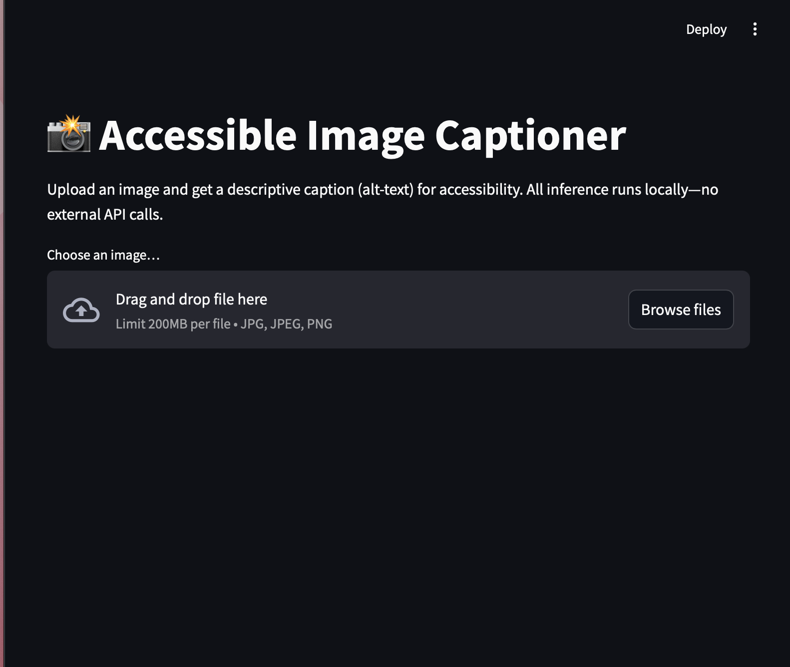

# Accessible_image_captioner

## Demo Screenshot

**Privacy-First Image-to-Text Demo**

This project demonstrates a minimal, local demo that generates descriptive captions (alt-text) for uploaded images—showcasing multimodal ML, accessibility focus, and on-device inference.

---

## 🔍 Overview

“Accessible Image Captioner” lets a user upload an image and immediately receive a concise, human-readable description. All processing happens locally (no external API calls), illustrating Apple’s emphasis on privacy. It uses a pretrained BLIP image-captioning model from Hugging Face and a Streamlit front end.

**Key Objectives:**
- Highlight **multimodal ML**: vision→language via a BLIP model  
- Emphasize **accessibility**: automatically produce alt-text for visually impaired users  
- Demonstrate **privacy-preserving**, on-device inference  
- Prototype an **interactive system** in a single day using Streamlit and PyTorch

---

## ⚙️ Features

- **Image Upload UI**: Simple Streamlit interface for `.jpg`/`.png` files  
- **Local Inference**: Uses `Salesforce/blip-image-captioning-base` under the hood—no cloud calls  
- **Quick Caption Generation**: Runs inference on CPU (or GPU if available) to produce a one-sentence caption  
- **Transparent Model Info**: Displays which pretrained model is being used  
- **Easy Reproducibility**: One command to launch the app after installing requirements

---

## 📥 Installation

1. **Clone this repository**
2. **Create & activate a virtual environment** (macOS/Linux example)
3.  **Install dependencies**

This installs:  
- `streamlit` (UI framework)  
- `transformers` (Hugging Face processor & model)  
- `torch` (PyTorch backend)  
- `pillow` (image loading)

---

## 🚀 Usage

1. **Run the Streamlit app**  

2. **In your browser**  
- A Streamlit page will open automatically (usually at `http://localhost:8501`)  
- Click “Browse files” or drag an image into the uploader  
- Wait a few seconds for “Generating caption…” to complete  
- View the generated caption under **Caption:**  

3. **Example Output**  
(Replace with your own screenshot named `screenshot.png`)  
  
_Caption:_ “A group of people standing in a kitchen”

---

## 🧱 How It Works

1. **Model & Processor**  
- Loads `BlipProcessor` and `BlipForConditionalGeneration` from Hugging Face (`Salesforce/blip-image-captioning-base`)  
- BLIP encodes the image using a Vision Transformer (ViT) backbone, then decodes into text

2. **Local Inference Flow**  
- **Upload**: User picks an image via Streamlit’s `file_uploader`  
- **Display**: The image is shown immediately using `st.image`  
- **Preprocessing**: The `BlipProcessor` resizes and normalizes the image  
- **Generate**: The model’s `.generate()` method produces token IDs  
- **Decode**: `processor.decode()` converts tokens to a human-readable caption  
- **Show**: Streamlit displays the resulting caption

3. **Privacy-First**  
- No network requests are made outside the local machine  
- All model weights and inference occur on the user’s device (CPU or GPU), ensuring no image data leaves the environment

---

## 📂 Repository Structure

- **`app.py`**: Main Streamlit application  
- **`requirements.txt`**: All Python dependencies exactly as installed  
- **`screenshot.png`**: Example screenshot showing the UI and a generated caption  
- **`venv/`**: Local virtual environment (do not commit)

---

## 🎓 Project Highlights

- **Rapid Prototyping**: Built in one day to meet Apple AIML’s emphasis on fast innovation  
- **Multimodal ML**: Uses vision and language models together  
- **Accessibility Focus**: Generates alt-text automatically, addressing real user needs  
- **Privacy-First Design**: All inference is local—no user data leaves the machine  
- **End-to-End Implementation**: From model loading to UI in under 200 lines of Python

---

## 🔮 Potential Extensions

- **Batch Processing**: Allow uploading multiple images at once and generate captions in a loop  
- **Adjustable Parameters**: Add sliders in the Streamlit sidebar for `max_length`, beam size, or attention head toggles  
- **Mobile UI**: Port the interface to a Swift playground or iOS prototype, integrating Core ML  
- **Evaluation Metrics**: Add BLEU or CIDEr scores if you have ground-truth captions  
- **Fairness Analysis**: Evaluate bias on different image subsets (e.g., under-represented scenarios)

---

## 🤝 Contributing & License

- Feel free to **fork** and improve this demo (e.g., swap in a different captioning model or add caching)  
- If you find bugs or have suggestions, please open an **Issue** on GitHub

This project is released under the [MIT License](https://opensource.org/licenses/MIT).

---

## 📬 Contact

**Uchechi Obi-Iwuagwu**  
- GitHub: [github.com/uchechiobi](https://github.com/uchechiobi)
- LinkedIn: [linkedin.com/in/ucheobi27](https://www.linkedin.com/in/ucheobi27/)  
- Email: ucheobiiwuagwu@gmail.com

Built as a one-day demo.  
